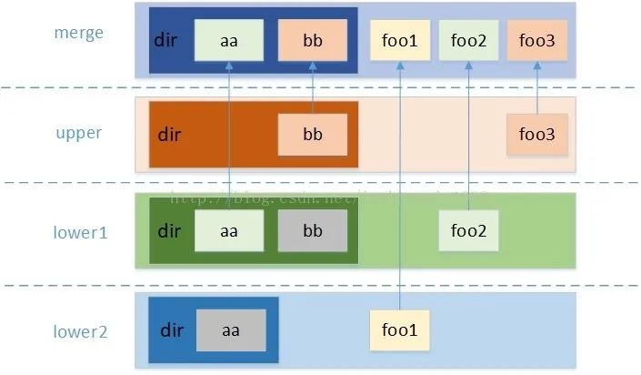

# Mount Namespace
它可以用来隔离不同的进程或进程组看到的挂载点。在容器内的挂载操作不会影响主机的挂载目录。
下面我们通过创建一个命名空间的例子看看Mount Namespace。
```
unshare --mount --fork /bin/bash
```
挂在一个目录
```
# mkdir /tmp/mnt
# mount -t tmpfs -o size=1m tmpfs /tmp/mnt
# df -h |grep mnt
tmpfs            1M     0   1M   0% /tmp/mnt
```
在命名空间内的挂载并不影响我们的主机目录，我们在主机上查看不到挂载信息
```
# df -h |grep mnt
```
那么现在有个问题，挂载目录后，如何避免进程间同时修改文件。这里就需要引入一个新的文件系统，联合文件系统，联合文件系统（Union File System, UFS）有多种实现，主要用于将多个目录层合并为一个统一视图，常见的有 OverlayFS（现代Docker首选）、AUFS（早期Docker使用）、Btrfs、ZFS、Device Mapper 及其变种（如 Overlay2）等，它们各有特点，常在容器技术（如Docker, Podman）中用于实现分层镜像。 
