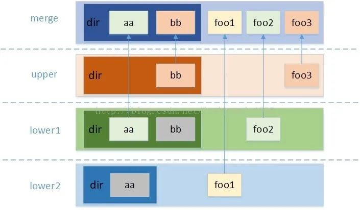
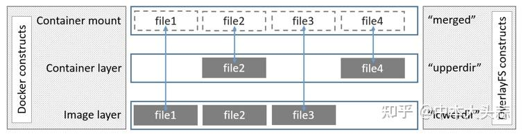

# Mount Namespace
它可以用来隔离不同的进程或进程组看到的挂载点。在容器内的挂载操作不会影响主机的挂载目录。
下面我们通过创建一个命名空间的例子看看Mount Namespace。
```
unshare --mount --fork /bin/bash
```
挂在一个目录
```
# mkdir /tmp/mnt
# mount -t tmpfs -o size=1m tmpfs /tmp/mnt
# df -h |grep mnt
tmpfs            1M     0   1M   0% /tmp/mnt
```
在命名空间内的挂载并不影响我们的主机目录，我们在主机上查看不到挂载信息
```
# df -h |grep mnt
```
那么现在有个问题，挂载目录后，如何避免进程间同时修改文件。这里就需要引入一个新的文件系统，联合文件系统，联合文件系统（Union File System, UFS）有多种实现，主要用于将多个目录层合并为一个统一视图，常见的有 OverlayFS（现代Docker首选）、AUFS（早期Docker使用）、Btrfs、ZFS、Device Mapper 及其变种（如 Overlay2）等，它们各有特点，常在容器技术（如Docker, Podman）中用于实现分层镜像。 


overlayFS是联合挂载技术的一种实现。除了overlayFS以外还有aufs，VFS，Brtfs，device mapper等技术。虽然实现细节不同，但是他们做的事情都是相同的。Linux内核为Docker提供的overalyFS驱动有2种：overlay2和overlay，overlay2是相对于overlay的一种改进，在inode利用率方面比overlay更有效。

overlayfs通过三个目录来实现：lower目录、upper目录、以及work目录。三种目录合并出来的目录称为merged目录

lower目录：可以是多个，是处于最底层的目录，作为只读层
upper目录：只有一个，作为读写层
work目录：为工作基础目录，挂载后内容会被清空，且在使用过程中其内容用户不可见，
merged目录：为最后联合挂载完成给用户呈现的统一视图，也就是说merged目录里面本身并没有任何实体文件，给我们展示的只是参与联合挂载的目录里面文件而已，真正的文件还是在lower和upper中。所以，在merged目录下编辑文件，或者直接编辑lower或upper目录里面的文件都会影响到merged里面的视图展示。
执行mount命令挂载overlayFS的语法为：
```
mount -t overlay overlay -o lowerdir=lower1:lower2:lower3,upperdir=upper,workdir=work merged_dir
```
看看实际中怎么用overlayFS吧。

执行以下命令：
```
mkdir -p /tmp/test A B C worker
cd /tmp/test
echo "From A" > A/a.txt
echo "From A" > A/b.txt
echo "From A" > A/c.txt 
echo "From B" > B/a.txt
echo "From B" > B/d.txt
echo "From C" > C/b.txt
echo "From C" > C/e.txt
```
创建如下图所示的一个文件结构
```
[root@practice-server test]# tree .
.
|-- A
|   |-- a.txt
|   |-- b.txt
|   `-- c.txt
|-- B
|   |-- a.txt
|   `-- d.txt
|-- C
|   |-- b.txt
|   `-- e.txt
`-- worker
```
接下来我们将A和B作为lower目录，C作为upper目录，worker做为work目录，进行联合挂载，并将挂载点放在/tmp/test/merged 上，执行以下命令
```
# /tmp/test目录下
mkdir merged
mount -t overlay overlay -o lowerdir=A:B,upperdir=C,workdir=worker /tmp/test/merged
```
现在我们来看看merged文件夹里面都有啥？首先看看文件结构
```
[root@practice-server merged]# tree .
.
|-- a.txt
|-- b.txt
|-- c.txt
|-- d.txt
`-- e.txt
```
可以看到之前的目录A、B、C被合并到了一起，并且相同文件名的文件会进行“覆盖”，这里覆盖并不是真正的覆盖，而是当合并时候目录中两个文件名称都相同时，merged层目录会显示离它最近层的文件。如下图所示，层级关系中upperdir比lowerdir更靠近merged层，而多个lowerdir的情况下，写的越靠前的目录离merged层目录越近。（这里merged层的file为虚线外框，表示文件实际上并不在merged目录下）


本例子中，C为upperdir，A和B是lowerdir，而mount时写法为lowerdir=A:B，所以A在B上层。整体层级关系为：C > A > B。可以看到目录A与目录B中有一个同名文件a.txt，目前C与目录A之间有一个重名文件b.txt，根据上述论断，merged目录中a.txt应该显示的是A的内容，而b.txt应该显示的是C的内容。我们来确认下：
```
[root@practice-server merged]# cat a.txt 
From A
[root@practice-server merged]# cat b.txt 
From C
```
OK，到这为止，相信大家已经搞清楚了联合挂载的层级关系以及覆盖模式。接下来我们来看看联合挂载的读写模式。前面提到upperdir（本例的C）是一个读写层，而lowerdir（本例的A和B）是一个只读层。怎么来验证呢？本例子中lowerdir A和B中有一个a.txt，而该文件在upperdir C中没有，如果我们再merged文件夹中删除该文件会发生什么呢？我们来看看
```
[root@practice-server test]# rm merged/a.txt
[root@practice-server test]# tree .
.
|-- A
|   |-- a.txt (没变)
|   |-- b.txt
|   `-- c.txt
|-- B
|   |-- a.txt (没变)
|   `-- d.txt
|-- C
|   |-- a.txt (多出来一个)
|   |-- b.txt
|   `-- e.txt
|-- merged
|   |-- b.txt
|   |-- c.txt
|   |-- d.txt
|   `-- e.txt
`-- worker
    `-- work
```
在merged目录下面删除 a.txt，merged dir中a.txt 确实是消失了，但是A和B中的a.txt依然存在，且更神奇的是C里面还多出来一个a.txt，我们来看看这个多出来的文件是什么鬼：
```
[root@practice-server test]# ls -l C/a.txt 
c--------- 1 root root 0, 0 May 24 22:51 C/a.txt
```
可以看到这个多出来的文件很奇怪，文件类型是c，也就是一种字符设备文件。这里我也不卖官司了。其实这个文件被称为whiteout文件，它的作用就是覆盖lowerdir中的a.txt来表示该文件被删除的，因为lowerdir中的文件只读，所以只能在upperdir中通过这种“曲线救国”的方式来达到删除只读层文件的效果。

我们再来做个文件修改玩玩，从上面的文件夹结构可以看到d.txt只在B里面有，如果我在merged里面修改d.txt会怎么样呢？
```
[root@practice-server test]# echo "From merged" > merged/d.txt 
[root@practice-server test]# cat B/d.txt 
From B
[root@practice-server test]# ls C/
a.txt  b.txt  d.txt  e.txt
[root@practice-server test]# cat C/d.txt 
From merged
```
这次我们看到B中的d.txt依然岿然不动，又是在C中创建了一个新的d.txt并付了新的内容 "From merged"，根据之前我们学的覆盖规则，这样在merged视角下，d.txt的内容就从之前的"From B"变成了"From merged"了。值得一提的是，在修改d.txt的时候，应用到了写时复制（Copy on Write）技术，在未更改文件内容时，merged目录直接使用lowerdir中的数据，只有当merged目录中数据发生变化时，才会把变化的文件（也就是本例中的d.txt）内容复制到可读写层（本例中的C）进行修改，并隐藏只读层中的老版本文件。
