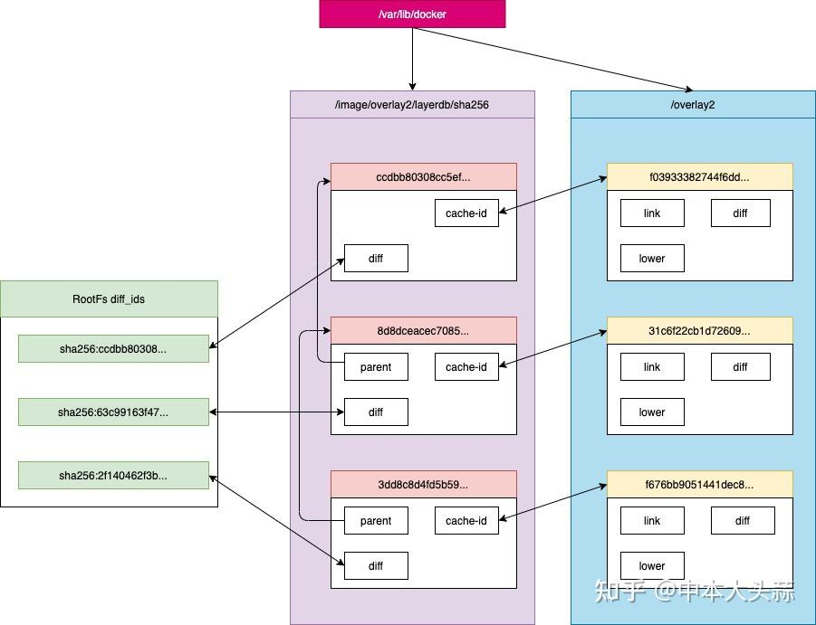

# Image file system的介绍以及实操
## 1. image存储结构
我们先docker pull个ubuntu镜像下来，接下来我们来对他进行解剖。
```
[root@practice-server ~]# docker pull ubuntu
Using default tag: latest
latest: Pulling from library/ubuntu
345e3491a907: Pull complete 
57671312ef6f: Pull complete 
5e9250ddb7d0: Pull complete 
Digest: sha256:cf31af331f38d1d7158470e095b132acd126a7180a54f263d386da88eb681d93
Status: Downloaded newer image for ubuntu:latest
docker.io/library/ubuntu:latest
```
当我们pull一个image的时候，可以看到output里面有很多xxxxxxxx: Pull complete，这里面每条表示image的一个层。这些层联合挂载起来构成了image的整体的文件结构。我们来看看ubuntu image的rootfs结构：
```
[root@practice-server ~]# docker image inspect ubuntu
[
...
        "GraphDriver": {
            "Data": {
                "LowerDir": "/var/lib/docker/overlay2/31c6f22cb1d72609fc59f0225e74fac0c5cb54825ce1e475f37fff3160dcb401/diff:/var/lib/docker/overlay2/f03933382744f6dd3888f8a3eac00c19279559288fc4e959b8bc8540d9a7d188/diff",
                "MergedDir": "/var/lib/docker/overlay2/f676bb9051441dec8f324cdecfb7fe6e4feefd6baa6e1a3a49f612e21668628f/merged",
                "UpperDir": "/var/lib/docker/overlay2/f676bb9051441dec8f324cdecfb7fe6e4feefd6baa6e1a3a49f612e21668628f/diff",
                "WorkDir": "/var/lib/docker/overlay2/f676bb9051441dec8f324cdecfb7fe6e4feefd6baa6e1a3a49f612e21668628f/work"
            },
            "Name": "overlay2"
        },
...
]
```
首先我们看看GraphDriver里面的内容，里面记录了ubuntu image的lower，merged，upper和workdir目录，有了上一节中overlay的基础后，这里就不难懂了。如果套用上节的例子的话，我们可以建立如下的对应关系：
```
A -> /var/lib/docker/overlay2/31c6f22cb1d72609fc59f0225e74fac0c5cb54825ce1e475f37fff3160dcb401/diff
B -> /var/lib/docker/overlay2/f03933382744f6dd3888f8a3eac00c19279559288fc4e959b8bc8540d9a7d188/diff
C -> /var/lib/docker/overlay2/f676bb9051441dec8f324cdecfb7fe6e4feefd6baa6e1a3a49f612e21668628f/diff
work -> /var/lib/docker/overlay2/f676bb9051441dec8f324cdecfb7fe6e4feefd6baa6e1a3a49f612e21668628f/work
merged -> /var/lib/docker/overlay2/f676bb9051441dec8f324cdecfb7fe6e4feefd6baa6e1a3a49f612e21668628f/merged
```
如果我们自己做下联合挂载呢， 应该很有意思，执行下面的命令将A，B，C和work mount到/tmp/ubuntu目录：
```
mkdir /tmp/ubuntu
# 把A，B，C，work全部替换进mount -t overlay overlay -o lowerdir=A:B,upperdir=C,workdir=worker /tmp/ubuntu
mount -t overlay overlay -o lowerdir=/var/lib/docker/overlay2/31c6f22cb1d72609fc59f0225e74fac0c5cb54825ce1e475f37fff3160dcb401/diff:/var/lib/docker/overlay2/f03933382744f6dd3888f8a3eac00c19279559288fc4e959b8bc8540d9a7d188/diff,upperdir=/var/lib/docker/overlay2/f676bb9051441dec8f324cdecfb7fe6e4feefd6baa6e1a3a49f612e21668628f/diff,workdir=/var/lib/docker/overlay2/f676bb9051441dec8f324cdecfb7fe6e4feefd6baa6e1a3a49f612e21668628f/work /tmp/ubuntu
```
我们再来看看/tmp/ubuntu目录，出现了一个完整的ubuntu 系统目录！
```
# ls /tmp/ubuntu/
bin  boot  dev  etc  home  lib  lib32  lib64  libx32  media  mnt  opt  proc  root  run  sbin  srv  sys  tmp  usr  var
```
接下来我们来看看这些/var/lib/docker/overlay2/xxxxxx/ 里面都有啥，我们就拿A做个例子吧
```
# cd /var/lib/docker/overlay2/31c6f22cb1d72609fc59f0225e74fac0c5cb54825ce1e475f37fff3160dcb401/
# ls -l
total 16
-rw------- 1 root root    0 May 25 09:30 committed
drwxr-xr-x 5 root root 4096 May 25 09:30 diff
-rw-r--r-- 1 root root   26 May 25 09:30 link
-rw-r--r-- 1 root root   28 May 25 09:30 lower
drwx------ 2 root root 4096 May 25 09:30 work
```
其中比较重要的有diff目录，link和lower文件，他们分别表示：

diff目录存放的是当前层的文件，可以看到由层高到底顺序(C > A > B)，ubuntu image的各层文件结构。B层贡献最多，C和A层对B层有些许覆盖
```
# ls f676bb9051441dec8f324cdecfb7fe6e4feefd6baa6e1a3a49f612e21668628f/diff
run
# ls 31c6f22cb1d72609fc59f0225e74fac0c5cb54825ce1e475f37fff3160dcb401/diff
etc  usr  var
# ls f03933382744f6dd3888f8a3eac00c19279559288fc4e959b8bc8540d9a7d188/diff
bin  boot  dev  etc  home  lib  lib32  lib64  libx32  media  mnt  opt  proc  root  run  sbin  srv  sys  tmp  usr  var
```
link和lower的内容分别是当前层和下一层的软链接名字。如果本层是当前层是底层，则lower文件不存在。真正的软链接文件都存在/var/lib/docker/overlay2/目录下 ，分别指向对应层的diff目录
```
# cat link
IJ3AMQTOZLJLGGKI2QD4ZUYMWL
# cat lower 
l/LOUK5YCGUFNOCFMQ3XJOCNSZLY
# ls /var/lib/docker/overlay2/l
lrwxrwxrwx 1 root root 72 May 25 09:30 ADEOHJ2KRX5FRFFMLOR4TIEMQJ -> ../f676bb9051441dec8f324cdecfb7fe6e4feefd6baa6e1a3a49f612e21668628f/diff
lrwxrwxrwx 1 root root 72 May 25 09:30 IJ3AMQTOZLJLGGKI2QD4ZUYMWL -> ../31c6f22cb1d72609fc59f0225e74fac0c5cb54825ce1e475f37fff3160dcb401/diff
lrwxrwxrwx 1 root root 72 May 25 09:30 LOUK5YCGUFNOCFMQ3XJOCNSZLY -> ../f03933382744f6dd3888f8a3eac00c19279559288fc4e959b8bc8540d9a7d188/diff
```
## 2. Image 元数据（metadata）
镜像元数据存储在了/var/lib/docker/image/<storage_driver>/imagedb/content/sha256/目录下，名称是以镜像ID命名的文件，镜像ID可通过docker images查看，这些文件以json的形式保存了该镜像的rootfs信息、镜像创建时间、构建历史信息、所用容器、包括启动的Entrypoint和CMD等等。

例如，本例中ubuntu镜像的id为7e0aa2d69a15:
```
# docker images -a
REPOSITORY   TAG       IMAGE ID       CREATED       SIZE
ubuntu       latest    7e0aa2d69a15   4 weeks ago   72.7MB
```
本例中ubuntu镜像的元数据为：
```
# cd /var/lib/docker/image/overlay2/imagedb/content/sha256
# ls
7e0aa2d69a153215c790488ed1fcec162015e973e49962d438e18249d16fa9bd
# cat 7e0aa2d69a153215c790488ed1fcec162015e973e49962d438e18249d16fa9bd 
{"architecture":"amd64","config":{"Hostname":"","Domainname":"","User":"","AttachStdin":false,"AttachStdout":false,"AttachStderr":false,"Tty":false,"OpenStdin":false,"StdinOnce":false,"Env":["PATH=/usr/local/sbin:/usr/local/bin:/usr/sbin:/usr/bin:/sbin:/bin"],"Cmd":["/bin/bash"],"Image":"sha256:9d6065aabb67e06ae6b6db4f0ed5ac83f5e83a147fa5eb32b414d10583f6ce2d","Volumes":null,"WorkingDir":"","Entrypoint":null,"OnBuild":null,"Labels":null},"container":"8be4461fbc3e2d9db869e63a5e140b10a085b1799c12e8a83b32aba9344eba78","container_config":{"Hostname":"8be4461fbc3e","Domainname":"","User":"","AttachStdin":false,"AttachStdout":false,"AttachStderr":false,"Tty":false,"OpenStdin":false,"StdinOnce":false,"Env":["PATH=/usr/local/sbin:/usr/local/bin:/usr/sbin:/usr/bin:/sbin:/bin"],"Cmd":["/bin/sh","-c","#(nop) ","CMD [\"/bin/bash\"]"],"Image":"sha256:9d6065aabb67e06ae6b6db4f0ed5ac83f5e83a147fa5eb32b414d10583f6ce2d","Volumes":null,"WorkingDir":"","Entrypoint":null,"OnBuild":null,"Labels":{}},"created":"2021-04-23T22:21:37.49442735Z","docker_version":"19.03.12","history":[{"created":"2021-04-23T22:21:34.1865992Z","created_by":"/bin/sh -c #(nop) ADD file:5c44a80f547b7d68b550b0e64aef898b361666857abf9a5c8f3f8d0567b8e8e4 in / "},{"created":"2021-04-23T22:21:35.354865637Z","created_by":"/bin/sh -c set -xe \t\t\u0026\u0026 echo '#!/bin/sh' \u003e /usr/sbin/policy-rc.d \t\u0026\u0026 echo 'exit 101' \u003e\u003e /usr/sbin/policy-rc.d \t\u0026\u0026 chmod +x /usr/sbin/policy-rc.d \t\t\u0026\u0026 dpkg-divert --local --rename --add /sbin/initctl \t\u0026\u0026 cp -a /usr/sbin/policy-rc.d /sbin/initctl \t\u0026\u0026 sed -i 's/^exit.*/exit 0/' /sbin/initctl \t\t\u0026\u0026 echo 'force-unsafe-io' \u003e /etc/dpkg/dpkg.cfg.d/docker-apt-speedup \t\t\u0026\u0026 echo 'DPkg::Post-Invoke { \"rm -f /var/cache/apt/archives/*.deb /var/cache/apt/archives/partial/*.deb /var/cache/apt/*.bin || true\"; };' \u003e /etc/apt/apt.conf.d/docker-clean \t\u0026\u0026 echo 'APT::Update::Post-Invoke { \"rm -f /var/cache/apt/archives/*.deb /var/cache/apt/archives/partial/*.deb /var/cache/apt/*.bin || true\"; };' \u003e\u003e /etc/apt/apt.conf.d/docker-clean \t\u0026\u0026 echo 'Dir::Cache::pkgcache \"\"; Dir::Cache::srcpkgcache \"\";' \u003e\u003e /etc/apt/apt.conf.d/docker-clean \t\t\u0026\u0026 echo 'Acquire::Languages \"none\";' \u003e /etc/apt/apt.conf.d/docker-no-languages \t\t\u0026\u0026 echo 'Acquire::GzipIndexes \"true\"; Acquire::CompressionTypes::Order:: \"gz\";' \u003e /etc/apt/apt.conf.d/docker-gzip-indexes \t\t\u0026\u0026 echo 'Apt::AutoRemove::SuggestsImportant \"false\";' \u003e /etc/apt/apt.conf.d/docker-autoremove-suggests"},{"created":"2021-04-23T22:21:36.274883825Z","created_by":"/bin/sh -c [ -z \"$(apt-get indextargets)\" ]","empty_layer":true},{"created":"2021-04-23T22:21:37.334286535Z","created_by":"/bin/sh -c mkdir -p /run/systemd \u0026\u0026 echo 'docker' \u003e /run/systemd/container"},{"created":"2021-04-23T22:21:37.49442735Z","created_by":"/bin/sh -c #(nop)  CMD [\"/bin/bash\"]","empty_layer":true}],"os":"linux","rootfs":{"type":"layers","diff_ids":["sha256:ccdbb80308cc5ef43b605ac28fac29c6a597f89f5a169bbedbb8dec29c987439","sha256:63c99163f47292f80f9d24c5b475751dbad6dc795596e935c5c7f1c73dc08107","sha256:2f140462f3bcf8cf3752461e27dfd4b3531f266fa10cda716166bd3a78a19103"]}}
```
我们重点来看看rootfs信息，docker inspect下这个ubuntu image，可以看到有个RootFS项，里面记录了一些sha256 哈希值，这又是什么呢？
```
# docker image inspect ubuntu
[
...
        "RootFS": {
            "Type": "layers",
            "Layers": [
                "sha256:ccdbb80308cc5ef43b605ac28fac29c6a597f89f5a169bbedbb8dec29c987439",
                "sha256:63c99163f47292f80f9d24c5b475751dbad6dc795596e935c5c7f1c73dc08107",
                "sha256:2f140462f3bcf8cf3752461e27dfd4b3531f266fa10cda716166bd3a78a19103"
            ]
        },
...
]
```
其实上面的每个sha256:后面的哈希值称为diff_id，其排列也是有顺序的，从上到下依次表示镜像层的最低层到最顶层。前面我们讲到ubuntu的每层文件都存储在/var/lib/docker/overlay2/<cache_id>目录下，diff_id如何关联到cache_id呢？具体说来，docker 利用 rootfs 中的每个diff_id 和历史信息计算出与之对应的内容寻址的索引(chainID) ，而chaiID则关联了cache_id，进而关联到每一个镜像层的镜像文件。

这里一下子冒出来很多个ID，我现在罗列一下，希望别把大家搞混，每个层都有3个ID：

cache_id: 可以在/var/lib/docker/overlay2中查看，也可以通过docker inpect 查看GraphDriver中的dir ID。
diff_id：通过docker inpect查看RootFS中的Layers项目
chain_id: 可以在/var/lib/docker/image/overlay2/layerdb/sha256查看
关于docker更多ID，可以参考：
1. Kingdo：docker中镜像存储中各个ID的详细介绍（imageID\cacheID\diffID...）
2. 1.10 Distribution Changes Design Doc
具体关系为：
```
diff_id -> chain_id -> cache_id
```
例如本例子中：
```
# layer_id有：
# ls /var/lib/docker/overlay2
31c6f22cb1d72609fc59f0225e74fac0c5cb54825ce1e475f37fff3160dcb401
f03933382744f6dd3888f8a3eac00c19279559288fc4e959b8bc8540d9a7d188
f676bb9051441dec8f324cdecfb7fe6e4feefd6baa6e1a3a49f612e21668628f

# diff_id有
"sha256:ccdbb80308cc5ef43b605ac28fac29c6a597f89f5a169bbedbb8dec29c987439",
"sha256:63c99163f47292f80f9d24c5b475751dbad6dc795596e935c5c7f1c73dc08107",
"sha256:2f140462f3bcf8cf3752461e27dfd4b3531f266fa10cda716166bd3a78a19103"

# chain_id有
# ls /var/lib/docker/image/overlay2/layerdb/sha256
3dd8c8d4fd5b59d543c8f75a67cdfaab30aef5a6d99aea3fe74d8cc69d4e7bf2  
ccdbb80308cc5ef43b605ac28fac29c6a597f89f5a169bbedbb8dec29c987439
8d8dceacec7085abcab1f93ac1128765bc6cf0caac334c821e01546bd96eb741
```
从diff_id到chain_id的算法为：

如果该镜像层是最底层(没有父镜像层)，该层的 diff_id 便是 chain_id。
该镜像层的 chain_id 计算公式为 chainID=sha256(父层chain_id+" "+本层diff_id)，也就是根据父镜像层的 chain_id 加上一个空格和当前层的 diff_id，再计算 SHA256 校验码。
比如，我们知道RootFS的diff_id从上到下依次表示镜像层的最低层到最顶层根据上述算法，所以本例子中底层的diff_id为ccdbb80308cc5ef43b605ac28fac29c6a597f89f5a169bbedbb8dec29c987439 ，此外我们可以发现有一个chain_id与该diff_id相同。这也好理解，因为对于底层来讲diff_id 便是 chain_id。

知道了chain_id之后如何查到cache_id呢？这就要请layer元数据上场了。
## 3. Layer 元数据
Docker 中定义了 Layer 和 RWLayer 两种接口，分别用来定义只读层和可读写层的一些操作，又定义了 roLayer 和 mountedLayer，分别实现了上述两种接口。其中:

roLayer 用于描述不可改变的镜像层，它的元数据位于 /var/lib/docker/image/<storage_driver>/layerdb/sha256/<chain_id>
mountedLayer 用于描述可读写的容器层。它的元数据位于/var/lib/docker/image/<storage_driver>/layerdb/mounts/<container_id>/
我们先来看看 roLayer，下面都有哪些元数据：
```
# cd /var/lib/docker/image/overlay2/layerdb/sha256
# tree .
.
|-- 3dd8c8d4fd5b59d543c8f75a67cdfaab30aef5a6d99aea3fe74d8cc69d4e7bf2
|   |-- cache-id
|   |-- diff
|   |-- parent
|   |-- size
|   `-- tar-split.json.gz
|-- 8d8dceacec7085abcab1f93ac1128765bc6cf0caac334c821e01546bd96eb741
|   |-- cache-id
|   |-- diff
|   |-- parent
|   |-- size
|   `-- tar-split.json.gz
`-- ccdbb80308cc5ef43b605ac28fac29c6a597f89f5a169bbedbb8dec29c987439
    |-- cache-id
    |-- diff
    |-- size
    `-- tar-split.json.gz
```
可以看到每个文件夹的名字都是chain_id，每个文件夹下面有5个文件，分别是：

cache-id：cache-id是docker下载layer的时候在本地生成的一个随机uuid，指向真正存放layer文件的地方。
diff：文件存放layer的diff_id。
parent：parent文件存放当前layer的父layer的diff_id，注意：对于最底层的layer来说，由于没有父layer，所以没有这个文件，例如本例子中的ccdbb80308cc5ef43b605ac28fac29c6a597f89f5a169bbedbb8dec29c987439 。
size：当前layer的大小，单位是字节。
tar-split.json.gz：layer压缩包的split文件，通过这个文件可以还原layer的tar包，在docker save导出image的时候会用到，详情可参考https://github.com/vbatts/tar-split。
至此我们终于知道了怎么从chain_id找到cache_id了。我们以8d8dceacec7085abcab1f93ac1128765bc6cf0caac334c821e01546bd96eb741为例子展示下上述文件：
```
# cd 8d8dceacec7085abcab1f93ac1128765bc6cf0caac334c821e01546bd96eb741

# cat cache-id 
31c6f22cb1d72609fc59f0225e74fac0c5cb54825ce1e475f37fff3160dcb401
# 通过该layer的chain_id查看文件
# ls /var/lib/docker/image/overlay2/layerdb/sha256/8d8dceacec7085abcab1f93ac1128765bc6cf0caac334c821e01546bd96eb741
committed  diff  link  lower  work

# cat diff 
sha256:63c99163f47292f80f9d24c5b475751dbad6dc795596e935c5c7f1c73dc08107

# cat parent
sha256:ccdbb80308cc5ef43b605ac28fac29c6a597f89f5a169bbedbb8dec29c987439

# cat size 
811
```
如果总结下所有文件夹之间的关联，可以获得如下图：


文件夹与各种ID之间的关联图
将Layer元数据时我们提到有2种Layer：roLayer 和 mountedLayer。上文只讲了roLayer，接下来我们在Container 文件系统里面再看看mountedLayer。