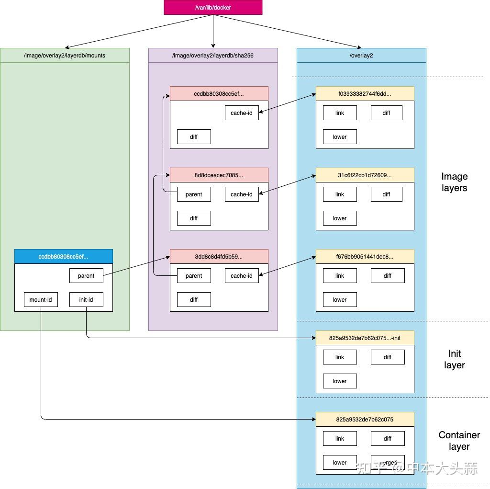

# Container file system的介绍以及实操
一个容器完整的层应由三个部分组成：

镜像层：也称为rootfs，提供容器启动的文件系统。rootfs也就是我们上一节中分析的image文件。镜像层属于roLayer。
init层： 用于修改容器中一些文件如/etc/hostname，/etc/hosts，/etc/resolv.conf等。init层属于mountedLayer。
容器层：使用联合挂载统一给用户提供的可读写目录。容器层属于mountedLayer。
镜像层我们已经在上一节中进行了详细分析，这一节我们主要看看init层和容器层。我们启动一个容器来看看这2层都长啥样。先启动一个container
```
# docker run -it --name test ubuntu /bin/bash
root@d37c50151d3d:/# 
```
另起一个窗口，来到mountedLayer的元数据目录/var/lib/docker/image/<storage_driver>/layerdb/mounts/<container_id>/查看该container的init层与容器层元数据
```
# cd /var/lib/docker/image/overlay2/layerdb/mounts/d37c50151d3df6c196f9c1d5a392f48f8d695e2b4026b874ab37e926b1561151
# ls
init-id  mount-id  parent
# cat init-id
825a9532de7b62c0752b71d0d318b64b2826f133fe8c061f0afa68993f4cc756-init
# cat mount-id
825a9532de7b62c0752b71d0d318b64b2826f133fe8c061f0afa68993f4cc756
# cat parent
sha256:3dd8c8d4fd5b59d543c8f75a67cdfaab30aef5a6d99aea3fe74d8cc69d4e7bf2
```
可以看到该文件夹有3种文件：

mount-id：存储在/var/lib/docker/overlay2/的目录名称。
init-id：initID是在mountID后加了一个-init，同时initID就是存储在/var/lib/docker/overlay2/的目录名称。
parent：容器所基于的镜像的最上层的chain_id。（注意这个parent和roLayer元数据的parent的不同之处）
首先我们到/var/lib/docker/overlay2/ 来看看init layer的内容：
```
# cd /var/lib/docker/overlay2/
# tree 825a9532de7b62c0752b71d0d318b64b2826f133fe8c061f0afa68993f4cc756-init/
825a9532de7b62c0752b71d0d318b64b2826f133fe8c061f0afa68993f4cc756-init/
|-- committed
|-- diff
|   |-- dev
|   |   |-- console
|   |   |-- pts
|   |   `-- shm
|   `-- etc
|       |-- hostname
|       |-- hosts
|       |-- mtab -> /proc/mounts
|       `-- resolv.conf
|-- link
|-- lower
`-- work
    `-- work
```
可以看到除了一些常规文件以外，diff里面只有一些/etc/hosts、/etc/resolv.conf等配置文件。需要这一层的原因是当容器启动时候，这些本该属于image层的文件或目录，比如hostname，用户需要修改，但是image层又不允许修改，所以启动时候通过单独挂载一层init层，通过修改init层中的文件达到修改这些文件目的。而这些修改往往只读当前容器生效，而在docker commit提交为镜像时候，并不会将init层提交。

我们再来看看容器层的内容：
```
# cd 825a9532de7b62c0752b71d0d318b64b2826f133fe8c061f0afa68993f4cc756
# ls
diff  link  lower  merged  work
# ls diff/
# ls merged/
bin  boot  dev  etc  home  lib  lib32  lib64  libx32  media  mnt  opt  proc  root  run  sbin  srv  sys  tmp  usr  var
```
我们可以看到merged目录就是容器内部进程所看到的文件时图，他是由镜像层，init层与容器层联合挂载而来的。（就像第一节中overlayFS例子中的，A，B，C，work一起挂载得到的merged目录一样）。

另外可以看到diff文件夹是空的，说明容器还未对文件进行任何修改。如果我们对某文件进行修改的话会怎么样了。比如我们在容器中删除/etc/fstab 文件。
```
# 在docker container中执行
root@d37c50151d3d:/etc# rm fstab 
# 在/var/lib/docker/overlay2/下查看
cd /var/lib/docker/overlay2/825a9532de7b62c0752b71d0d318b64b2826f133fe8c061f0afa68993f4cc756/diff/etc
# ls -l
total 0
c--------- 1 root root 0, 0 May 25 15:32 fstab
```
可以看到diff文件夹下多出来一个/etc/fstab的whiteout文件，此文件覆盖了下层的/etc/fstab，导致我们在container中看不到它了，但它在image中依然存在。是不是会想起overlayFS的那个例子了！
最后再来一张图总结下，container文件系统中各文件之间的关系。

